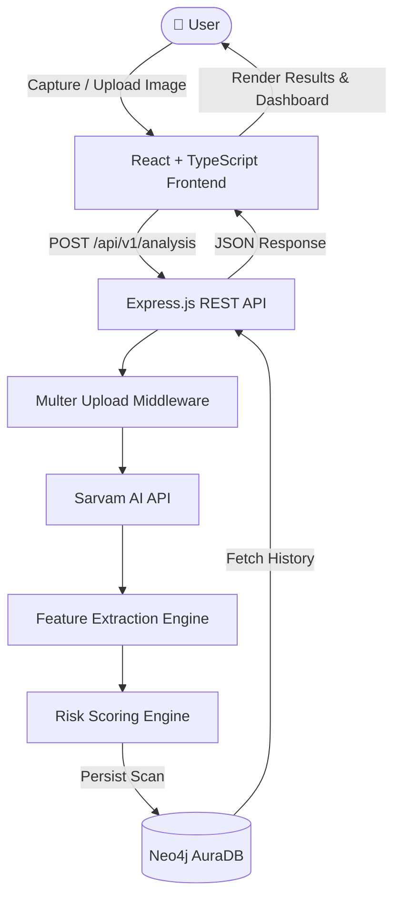

<div align="center">

# 🔬 MicroScan Edge

### AI-Powered Skin Health Analysis, Instantly

*Upload a photo. Get an AI-assisted risk read in seconds. Track it over time.*

<br/>

[](LICENSE)
[](https://react.dev/)
[](https://www.typescriptlang.org/)
[](https://nodejs.org/)
[](https://expressjs.com/)
[](https://neo4j.com/cloud/aura/)
[](https://vercel.com/)
[](https://railway.app/)

<br/>

[Overview](#-project-overview) · [Features](#-features) · [Architecture](#-architecture) · [Installation](#-installation) · [API Docs](#-api-endpoints) · [Roadmap](#-future-improvements)

</div>

---

<details>
<summary>📑 <b>Table of Contents</b></summary>
<br/>

- [Project Overview](#-project-overview)
- [Problem Statement](#-problem-statement)
- [Solution](#-solution)
- [Features](#-features)
- [Architecture](#-architecture)
- [Tech Stack](#-tech-stack)
- [Folder Structure](#-folder-structure)
- [Installation](#-installation)
- [Environment Variables](#-environment-variables)
- [API Endpoints](#-api-endpoints)
- [Screenshots](#-screenshots)
- [Deployment](#-deployment)
- [Future Improvements](#-future-improvements)
- [Contributors](#-contributors)
- [License](#-license)
- [Acknowledgements](#-acknowledgements)

</details>

<div align="center">

## 📖 Project Overview

</div>

**MicroScan Edge** is an AI-powered skin health analysis platform built to make a first-pass skin assessment as easy as taking a photo. Users capture or upload an image of a skin concern, and the platform runs it through an AI-driven pipeline that extracts visual features, scores risk, and stores the result for future reference — all through a fast, modern, and fully responsive interface.

Built end-to-end in a hackathon sprint, MicroScan Edge combines a **React + TypeScript** frontend, a **Node.js + Express** backend, the **Sarvam AI API** for intelligent image understanding, and **Neo4j AuraDB** as a graph-native store for scans, users, and their evolving history.

<div align="center">

## ❗ Problem Statement

</div>

Skin conditions are among the most common health concerns worldwide, yet they're also among the most frequently ignored — until they get worse.

- 🕐 **Delayed detection matters.** Many skin conditions, including early-stage skin cancers, are far more treatable when caught early — but early signs are subtle and easy to dismiss.
- 🏥 **Access is uneven.** Dermatologist appointments can involve long waits, high costs, or simply aren't available in every region.
- 🔎 **Self-diagnosis is unreliable.** People often turn to random search results or forums, which can lead to unnecessary anxiety or false reassurance.
- 📉 **No easy way to track change.** Skin concerns evolve over time, but most people have no structured way to record and compare how a spot or condition changes week to week.

There's a clear gap for an accessible, instant, first-pass tool that helps people decide *"should I get this looked at?"* — without replacing the professionals who give the final answer.

<div align="center">

## 💡 Solution

</div>

MicroScan Edge closes that gap with a simple loop: **capture → analyze → track → act.**

1. 📸 The user captures or uploads a photo of the skin area of concern.
2. 🧠 The image is passed through an AI pipeline (Sarvam AI + a custom feature extraction layer) that quantifies visual markers like asymmetry, border irregularity, color variation, and texture.
3. ⚖️ A risk scoring engine converts those features into a clear **Low / Medium / High** risk level, backed by a confidence score.
4. 🕸️ The scan, its features, and its result are stored in **Neo4j AuraDB**, a graph database — a natural fit for modeling users, scans, and the relationships between them over time.
5. 📊 Every past scan is available in a **history view** and an **analytics dashboard**, so users can see how something has changed.

> ⚠️ **Disclaimer:** MicroScan Edge is a hackathon project built for educational and demonstrative purposes. It is **not** a certified medical device, and its output should **never** replace a diagnosis from a licensed dermatologist or physician. When in doubt, see a doctor.

<div align="center">

## ✨ Features

</div>


| | Feature | Description |
|:---:|---|---|
| 🧠 | **AI-Powered Skin Analysis** | Deep image understanding via the Sarvam AI API to assess uploaded skin images |
| 📸 | **Camera & Gallery Upload** | Capture a photo live from the device camera or upload an existing image |
| 🔍 | **Automatic Feature Extraction** | Quantifies asymmetry, border irregularity, color variation, and texture |
| ⚠️ | **Risk Assessment** | Classifies every scan as **Low**, **Medium**, or **High** risk |
| 🎯 | **Confidence Scoring** | Every prediction ships with a transparent confidence percentage |
| 🕘 | **Historical Scan Management** | Every scan is saved and browsable, so users can revisit past results |
| 📊 | **Analytics Dashboard** | Visual trends across a user's scan history over time |
| 📱 | **Responsive UI** | A clean experience across mobile, tablet, and desktop |
| ✨ | **Modern Animations** | Smooth, subtle transitions for a polished, native-feeling UI |
| 🔒 | **Secure REST APIs** | Structured, validated Express endpoints for every operation |
| 🕸️ | **Graph Database Integration** | Neo4j AuraDB models users, scans, and history as connected data |

<div align="center">

## 🏗️ Architecture

</div>

MicroScan Edge follows a clean, layered architecture that separates concerns between the client, the API, the AI pipeline, and persistence.



| Layer | Responsibility |
|---|---|
| 🎨 **Frontend (Client)** | React + TypeScript SPA (Vite, TanStack Router, Tailwind CSS, ShadCN UI) handling capture/upload, results, dashboard, and history views |
| 🔗 **Backend (API)** | Node.js + Express REST API that validates requests, handles uploads via Multer, and orchestrates the AI pipeline |
| 🧠 **AI Service** | Sarvam AI API + a feature extraction module + a risk scoring engine that together turn pixels into a risk level and confidence score |
| 🕸️ **Database** | Neo4j AuraDB — a managed graph database storing users, scans, and the relationships between them for fast historical queries |

<div align="center">

## 🛠️ Tech Stack

</div>

| Category | Technology | Purpose |
|---|---|---|
| **Frontend** | React | Core component-based UI library |
| | TypeScript | Static typing for safer, more maintainable code |
| | Vite | Fast dev server and optimized production builds |
| | TanStack Router | Type-safe, modern routing |
| | Tailwind CSS | Utility-first styling |
| | ShadCN UI | Accessible, composable UI components |
| **Backend** | Node.js | JavaScript runtime for the server |
| | Express.js | Minimal, fast REST API framework |
| | Multer | Middleware for handling multipart image uploads |
| **AI Layer** | Sarvam AI API | Core AI inference for image understanding |
| | Feature Extraction Engine | Derives quantifiable visual metrics from images |
| | Risk Scoring Engine | Converts extracted features into a risk classification |
| **Database** | Neo4j AuraDB | Fully managed graph database for scans & history |
| **Deployment** | Vercel | Frontend hosting & CI/CD |
| | Railway | Backend hosting & CI/CD |

<div align="center">

## 📁 Folder Structure

</div>

<details>
<summary><b>🖥️ Frontend Structure</b></summary>

```text
frontend/
├── public/
├── src/
│   ├── assets/                # Images, icons, static assets
│   ├── components/
│   │   ├── ui/                # ShadCN UI components
│   │   ├── layout/            # Navbar, sidebar, page shells
│   │   └── shared/            # Reusable shared components
│   ├── features/
│   │   ├── analysis/          # Upload & analysis flow
│   │   ├── history/           # Historical scans
│   │   └── dashboard/         # Analytics dashboard
│   ├── routes/                # TanStack Router route definitions
│   ├── hooks/                 # Custom React hooks
│   ├── lib/                   # Utilities & helpers
│   ├── services/              # API client (fetch/axios wrappers)
│   ├── types/                 # Shared TypeScript types
│   ├── styles/                # Global Tailwind styles
│   ├── App.tsx
│   ├── main.tsx
│   └── router.tsx
├── .env.example
├── index.html
├── package.json
├── tailwind.config.ts
├── tsconfig.json
└── vite.config.ts
```

</details>

<details>
<summary><b>⚙️ Backend Structure</b></summary>

```text
backend/
├── src/
│   ├── config/
│   │   └── db.js                    # Neo4j driver & connection config
│   ├── controllers/
│   │   ├── analysis.controller.js
│   │   └── history.controller.js
│   ├── routes/
│   │   ├── analysis.routes.js
│   │   ├── history.routes.js
│   │   └── health.routes.js
│   ├── middleware/
│   │   ├── upload.middleware.js     # Multer configuration
│   │   └── error.middleware.js
│   ├── services/
│   │   ├── ai.service.js            # Sarvam AI integration
│   │   ├── featureExtraction.service.js
│   │   └── riskScoring.service.js
│   ├── models/
│   │   └── scan.model.js
│   ├── utils/
│   ├── app.js
│   └── server.js
├── uploads/                          # Temporary image storage
├── .env.example
└── package.json
```

</details>

<div align="center">

## ⚙️ Installation

</div>

### Prerequisites

- **Node.js** `v18+`
- **npm** `v9+` (or `yarn` / `pnpm`)
- A free **[Neo4j AuraDB](https://neo4j.com/cloud/aura/)** instance
- A **Sarvam AI API key** ([sarvam.ai](https://www.sarvam.ai/))

### 1. Clone the repository

```bash
git clone https://github.com/<your-username>/microscan-edge.git
cd microscan-edge
```

### 2. Frontend setup

```bash
cd frontend
npm install
cp .env.example .env   # then fill in the values — see Environment Variables
```

### 3. Backend setup

```bash
cd ../backend
npm install
cp .env.example .env   # then fill in the values — see Environment Variables
```

### 4. Run the backend

```bash
cd backend
npm run dev
# Backend runs on http://localhost:5000
```

### 5. Run the frontend

```bash
cd frontend
npm run dev
# Frontend runs on http://localhost:5173
```

Once both are running, open **http://localhost:5173** in your browser. 🎉

<div align="center">

## 🔑 Environment Variables

</div>

### Backend — `backend/.env`

| Variable | Description | Example |
|---|---|---|
| `PORT` | Port the Express server listens on | `5000` |
| `NODE_ENV` | Runtime environment | `development` |
| `NEO4J_URI` | Connection URI for your Neo4j AuraDB instance | `neo4j+s://xxxxxxxx.databases.neo4j.io` |
| `NEO4J_USERNAME` | Neo4j database username | `neo4j` |
| `NEO4J_PASSWORD` | Neo4j database password | `your-generated-password` |
| `SARVAM_AI_API_KEY` | API key used to authenticate with the Sarvam AI API | `sk-xxxxxxxxxxxxxxxx` |
| `SARVAM_AI_BASE_URL` | Base URL for the Sarvam AI API | `https://api.sarvam.ai` |
| `CORS_ORIGIN` | Allowed origin for CORS (your frontend URL) | `http://localhost:5173` |
| `MAX_FILE_SIZE_MB` | Maximum upload size accepted by Multer, in MB | `5` |
| `UPLOAD_DIR` | Local/temp directory for incoming image uploads | `./uploads` |

### Frontend — `frontend/.env`

| Variable | Description | Example |
|---|---|---|
| `VITE_API_BASE_URL` | Base URL of the backend REST API | `http://localhost:5000/api/v1` |
| `VITE_APP_NAME` | Display name used throughout the UI | `MicroScan Edge` |

> 🔐 Never commit real `.env` files. Only `.env.example` (with placeholder values) should be tracked in version control.

<div align="center">

## 🔌 API Endpoints

</div>

**Base URL:** `http://localhost:5000/api/v1` (local) · your deployed Railway URL in production

### `POST /api/v1/analysis`

Uploads a skin image and returns an AI-generated analysis.

| Field | Type | Required | Description |
|---|---|---|---|
| `image` | `file` | ✅ | The skin image (`.jpg`, `.jpeg`, `.png`) |
| `userId` | `string` | Optional | Associates the scan with a user for history tracking |
| `notes` | `string` | Optional | Free-text notes about the scan |

<details>
<summary>Example Request</summary>

```bash
curl -X POST http://localhost:5000/api/v1/analysis \
  -F "image=@/path/to/skin-image.jpg" \
  -F "userId=user_12345"
```

</details>

<details>
<summary>Example Response — <code>200 OK</code></summary>

```json
{
  "success": true,
  "data": {
    "scanId": "scan_8f3a1c2e",
    "riskLevel": "Medium",
    "confidenceScore": 87.4,
    "features": {
      "asymmetry": 0.62,
      "borderIrregularity": 0.48,
      "colorVariation": 0.71,
      "diameterMm": 6.2,
      "textureScore": 0.55
    },
    "recommendation": "Monitor the area for changes over the next 2 weeks. Consult a dermatologist if size, color, or shape changes.",
    "createdAt": "2026-07-14T10:32:00.000Z"
  }
}
```

</details>

<details>
<summary>Example Response — <code>400 Bad Request</code></summary>

```json
{
  "success": false,
  "error": {
    "code": "INVALID_IMAGE",
    "message": "No image file provided or unsupported file format."
  }
}
```

</details>

---

### `GET /api/v1/history`

Retrieves past scans for a given user, most recent first.

| Query Param | Type | Required | Description |
|---|---|---|---|
| `userId` | `string` | ✅ | The user whose scan history to retrieve |
| `limit` | `number` | Optional | Max number of results (default `20`) |
| `offset` | `number` | Optional | Pagination offset (default `0`) |

<details>
<summary>Example Request</summary>

```bash
curl -X GET "http://localhost:5000/api/v1/history?userId=user_12345&limit=10"
```

</details>

<details>
<summary>Example Response — <code>200 OK</code></summary>

```json
{
  "success": true,
  "count": 2,
  "data": [
    {
      "scanId": "scan_8f3a1c2e",
      "riskLevel": "Medium",
      "confidenceScore": 87.4,
      "createdAt": "2026-07-14T10:32:00.000Z"
    },
    {
      "scanId": "scan_7d2b0a91",
      "riskLevel": "Low",
      "confidenceScore": 92.1,
      "createdAt": "2026-07-10T09:15:00.000Z"
    }
  ]
}
```

</details>

---

### `GET /health`

Simple health check used for uptime monitoring and deployment verification. No parameters required.

<details>
<summary>Example Response — <code>200 OK</code></summary>

```json
{
  "status": "ok",
  "uptime": 123456,
  "timestamp": "2026-07-14T10:40:00.000Z",
  "database": "connected"
}
```

</details>

<div align="center">

## 📸 Screenshots

</div>

> 📌 Add your screenshots to `docs/screenshots/` and update the paths below.

| Home | Upload & Capture | Analysis Result |
|:---:|:---:|:---:|
|  |  |  |

| Analytics Dashboard | Scan History |
|:---:|:---:|
|  |  |

<div align="center">

## 🚀 Deployment

</div>

### 🌐 Frontend — Vercel

1. Push the repository to GitHub.
2. Import the project into [Vercel](https://vercel.com/).
3. Set the **root directory** to `frontend`.
4. Add the frontend environment variables (see above), pointing `VITE_API_BASE_URL` at your deployed Railway backend.
5. Deploy — Vercel builds with `npm run build` and serves the `dist/` output.

### 🚂 Backend — Railway

1. Create a new project on [Railway](https://railway.app/) and link the GitHub repository.
2. Set the **root directory** to `backend`.
3. Add the backend environment variables (see above).
4. Railway detects Node.js automatically and runs `npm start`.
5. Copy the generated public domain and use it to set `VITE_API_BASE_URL` on Vercel.

### 🕸️ Database — Neo4j AuraDB

1. Create a free instance at [neo4j.com/cloud/aura](https://neo4j.com/cloud/aura/).
2. Copy the connection URI, username, and generated password.
3. Add these as `NEO4J_URI`, `NEO4J_USERNAME`, and `NEO4J_PASSWORD` on Railway.
4. (Optional) Run any schema/constraint setup scripts included in the backend.

<div align="center">

## 🗺️ Future Improvements

</div>

- [ ] 🩺 Disease-specific classification (e.g., eczema, psoriasis, melanoma subtypes)
- [ ] 👨‍⚕️ Doctor consultation / telemedicine integration
- [ ] 🤖 AI-powered chatbot for symptom triage
- [ ] 📄 Automated PDF report generation
- [ ] 🌐 Multi-language support
- [ ] 🔐 User authentication & profile management
- [ ] 📱 Native mobile app (React Native / Flutter)
- [ ] ☁️ Cloud-based image storage (e.g., S3, Cloudinary)

<div align="center">

## 🤝 Contributors

</div>

Thanks to everyone who contributed to building MicroScan Edge! 💙

| Avatar | Name | Role | GitHub |
|:---:|---|---|---|
| 🧑‍💻 | Your Name | Full Stack Developer | [@your-username](https://github.com/your-username) |
| 🎨 | Teammate Name | Frontend / UI-UX | [@teammate-username](https://github.com/teammate-username) |
| 🧠 | Teammate Name | AI / Backend | [@teammate-username](https://github.com/teammate-username) |

<sub>Want to contribute? Fork the repo, create a feature branch, and open a pull request!</sub>

<div align="center">

## 📄 License

</div>

This project is licensed under the **MIT License**.

<details>
<summary>Click to view full MIT License text</summary>

```
MIT License

Copyright (c) 2026 MicroScan Edge Team

Permission is hereby granted, free of charge, to any person obtaining a copy
of this software and associated documentation files (the "Software"), to deal
in the Software without restriction, including without limitation the rights
to use, copy, modify, merge, publish, distribute, sublicense, and/or sell
copies of the Software, and to permit persons to whom the Software is
furnished to do so, subject to the following conditions:

The above copyright notice and this permission notice shall be included in all
copies or substantial portions of the Software.

THE SOFTWARE IS PROVIDED "AS IS", WITHOUT WARRANTY OF ANY KIND, EXPRESS OR
IMPLIED, INCLUDING BUT NOT LIMITED TO THE WARRANTIES OF MERCHANTABILITY,
FITNESS FOR A PARTICULAR PURPOSE AND NONINFRINGEMENT. IN NO EVENT SHALL THE
AUTHORS OR COPYRIGHT HOLDERS BE LIABLE FOR ANY CLAIM, DAMAGES OR OTHER
LIABILITY, WHETHER IN AN ACTION OF CONTRACT, TORT OR OTHERWISE, ARISING FROM,
OUT OF OR IN CONNECTION WITH THE SOFTWARE OR THE USE OR OTHER DEALINGS IN THE
SOFTWARE.
```

*(Copy this text into a `LICENSE` file at the root of your repository.)*

</details>

<div align="center">

## 🙏 Acknowledgements

</div>

MicroScan Edge wouldn't be possible without these amazing tools and platforms:

- [Sarvam AI](https://www.sarvam.ai/) — AI inference powering the core image analysis engine
- [Neo4j AuraDB](https://neo4j.com/cloud/aura/) — Fully managed graph database
- [Vercel](https://vercel.com/) — Frontend hosting & deployment
- [Railway](https://railway.app/) — Backend hosting & deployment
- [React](https://react.dev/) — UI library powering the frontend
- [Express.js](https://expressjs.com/) — Fast, minimalist backend framework
- [Tailwind CSS](https://tailwindcss.com/) — Utility-first CSS framework
- [ShadCN UI](https://ui.shadcn.com/) — Beautiful, accessible component library

<div align="center">

---

⭐ **If you found MicroScan Edge interesting, consider starring the repo!**

Built with ❤️ for **HACKHAZARD** 2026

</div>